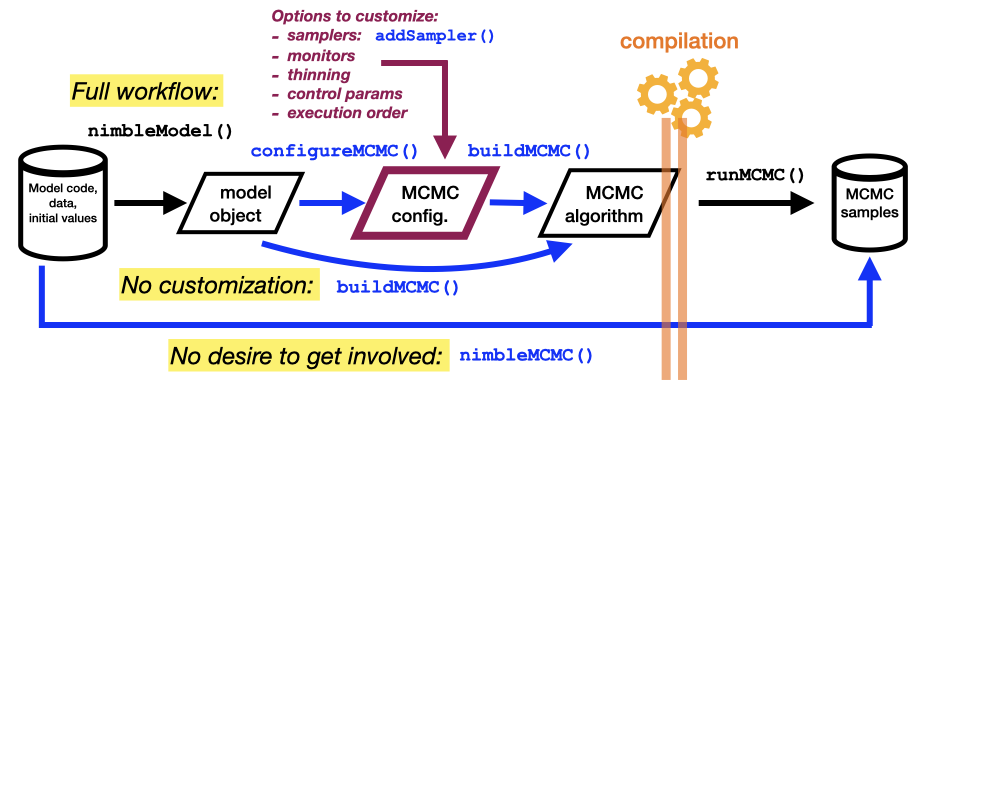
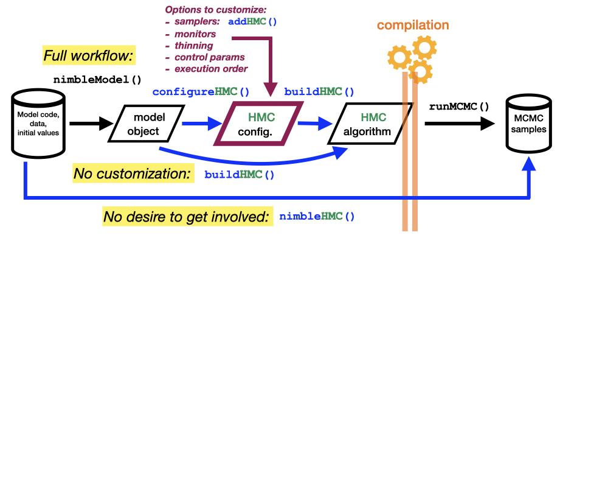

<style>
slides > slide {
  overflow-x: auto !important;
  overflow-y: auto !important;
}
</style>

```{r setup, include=FALSE}
knitr::opts_chunk$set(echo = TRUE, cache = TRUE)
library(nimble)
library(coda)
```


# Hamiltonian Monte Carlo (HMC) sampling

- There are many different options for MCMC sampling
  - Metropolis Hastings
  - slice sampling
  - conjugate (Gibbs) sampling
  - cross-level sampling
- NIMBLE is somewhat unique, allowing users to pick-and-choose their own MCMC sampling strategy.
- Different sampling algorithms vary in terms of computational requirements, and mixing / convergence.

\  

### Hamiltonian Monte Carlo

- **Hamiltonian Monte Carlo (HMC)** sampling is one sampling strategy 
  - Originally called *Hybird* Monte Carlo sampling <a href="https://www.sciencedirect.com/science/article/abs/pii/037026938791197X" target="_blank" style="color: blue">(Duane, et al, 1987)</a>
- Requires gradients of model density calculations (directional derivatives in parameter space).
- Applicable to continuous-valued parameters only
- Has the potential to generate large transitions in parameter space

  - The resulting MCMC samples can have low autocorrelation  
  - Therefore have high information content

\  

<a href="https://chi-feng.github.io/mcmc-demo/app.html" target="_blank" style="color: blue">Animated HMC Demo</a>


# No-U-Turn (NUTS) HMC Sampling

- Standard HMC requires setting tuning parameters:
  - Integration stepsize
  - Number of integration steps
- Performance is highly dependent on "good" choices of these parameters

- No-U-Turn variety of HMC relieves this burden
  - HMC-NUTS, or just NUTS sampling
  - <a href="https://www.jmlr.org/papers/volume15/hoffman14a/hoffman14a.pdf" target="_blank" style="color: blue">Hoffman and Gelman, 2014</a>)
  - Self-tunes these parameters
  - No manual tuning required
  - Greatly improves the applicability and ease-of-use of HMC sampling

### Rapid adoption of HMC into mainstream Bayesian analyses 

- Advent of the popular Stan software, which is engineered solely around HMC-NUTS sampling.
- Inclusion of HMC-NUTS sampling in pyMC3.

\  

### `nimbleHMC` package

- Implementation in the NIMBLE programming langauge
  - HMC-NUTS sampling is available for NIMBLE, using the `nimbleHMC` package


# What's in `nimbleHMC`

The `nimbleHMC` package has two main components:

\  

### 1. HMC Samplers

Provides two distinct HMC samplers, for use in NIMBLE's HMC engine

\  

- **`NUTS`** sampler, implements HMC-NUTS sampling algorithm, identical to that provided in Stan (version 2.32.2).
  - The default sampler for all HMC-related functions

\  

- **`NUTS_classic`** sampler, implements the original NUTS sampling algorithm
  - Described in <a href="https://www.jmlr.org/papers/volume15/hoffman14a/hoffman14a.pdf" target="_blank" style="color: blue">Hoffman and Gelman, 2014</a>
  - Provided for baseline performance and comparisons

\  

 These two samplers (`NUTS`, and `NUTS_classic`) are fully compatible for use in NIMBLE's MCMC engine.

- Can be added to an MCMC configuration object using the `addSampler` method:
  - `conf$addSampler(target = nodes, type = "NUTS")`

\  

### 2. Convenience Functions

`nimbleHMC` also provides a variety of convenience functions, for adding HMC samplings, and building MCMCs which include HMC samplers:

- **`addHMC`**: adds an HMC sampler to an existing MCMC configuration object 
- **`configureHMC`**: creates an MCMC configuration object, with HMC applied to all continuous-valued dimensions 
- **`buildHMC`**: build an MCMC algorithm, with HMC applied to all continuous-valued dimensions 
- **`nimbleHMC`**: builds, compiles, and executes an MCMC, with HMC applied to all continuous-valued dimensions 

\   

The multitude of these "convenience" functions make them sound more complicated than they are! ...


# "Convenience" Functions Explained 

 


# "Convenience" Functions Explained 

 


# Example: Dipper model with HMC (1)

We'll return to the dipper example from the first module.  We'll now sample this using HMC, in three different ways. 

\   

### 1. Full workflow, using `configureMCMC` and `addSampler`

- Here, we'll use the full workflow, where we modify the MCMC configuration object, to add an HMC sampler.  This workflow will use:
  - `nimbleModel`
  - `configureMCMC`
  - `addSampler` to add an HMC sampler
  - `buildMCMC`
  - `compileNimble`
  - `runMCMC`
  
\   

```{r }
library(nimble)
library(nimbleHMC)

dipper_example_dir <- file.path("..", "..", "content", "examples", "dipper")
dipper <- read.csv(file.path(dipper_example_dir,"dipper.csv"))
y <- as.matrix(dipper[ , 1:7])

first <- apply(y, 1, function(x) min(which(x != 1))) # first capture time
y <- y[ first != 7, ] # remove records with first capture on last occasion
first <- apply(y, 1, function(x) min(which(x != 1))) # first capture time

dipper_code <- nimbleCode({
    phi ~ dunif(0, 1)
    p ~ dunif(0, 1)
    for(i in 1:N) {
        for(t in (first[i]+1):T) {
            x[i,t] ~ dbern(phi * x[i,t-1])
            y[i,t] ~ dbern(p * x[i,t])
        }
    }
})

dipper_constants <- list(
    N = nrow(y),
    T = ncol(y),
    first = first
)

dipper_data <- list(y = y)

dipper_inits <- list(
    phi = 0.5,
    p = 0.5,
    x = array(1, dim(y))
)
```

Build model object:

*Note:* Need to specify `buildDerivs = TRUE` in the call to `nimbleModel`

```{r eval = FALSE}
Rmodel <- nimbleModel(
    dipper_code, dipper_constants, dipper_data, dipper_inits,
    buildDerivs = TRUE)
```

Make MCMC configuration object:

```{r eval = FALSE}
conf <- configureMCMC(Rmodel)
```

```
## ===== Monitors =====
## thin = 1: p, phi 
## ===== Samplers =====
## RW sampler (2) 
##   - phi 
##   - p 
## binary sampler (1720) 
##   - x[]  (1720 elements) 
```

Remove default RW samplers on "phi" and "p"

```{r eval = FALSE}
conf$removeSamplers(c("phi", "p"))
```

Add a NUTS sampler:

```{r eval = FALSE}
conf$addSampler(type = "NUTS", target = c("phi", "p"))

conf
```

```
## ===== Monitors =====
## thin = 1: p, phi
## ===== Samplers =====
## NUTS sampler (1)
##   - phi, p 
## binary sampler (1720)
##   - x[]  (1720 elements)
```

Build the MCMC algorithm:

```{r eval = FALSE}
Rmcmc <- buildMCMC(conf)
```

Compile model and MCMC:

```{r eval = FALSE}
Cmodel <- compileNimble(Rmodel)
Cmcmc <- compileNimble(Rmcmc, project = Rmodel)
```

```
## Compiling
##   [Note] This may take a minute.
##   [Note] Use 'showCompilerOutput = TRUE' to see C++ compilation details.
```

Execute the MCMC:

```{r eval = FALSE}
samples <- runMCMC(Cmcmc, 1000)
```

```
## running chain 1...
##   [Note] NUTS sampler (nodes: phi, p) is using 500 warmup iterations.
##          Since `warmupMode` is 'default' and `nburnin` = 0,
##          the number of warmup iterations is equal to `niter/2`.
##          No samples will be discarded, so the first half of the samples returned
##          are from the warmup period, and the second half of the samples are post-warmup.
## |-------------|-------------|-------------|-------------|
## |-------------------------------------------------------|
```


```{r echo = FALSE}
load("~/github/nimble/workshops/nimble-isec-2024/content/examples/dipper/dipperSamples1.RData")
```

```{r}
library(coda)
plot(as.mcmc(samples))
```


# Example: Dipper model with HMC (2)


We'll return to the dipper example from the first module.  We'll now sample this using HMC, in three different ways. 

\   

### 2. Using `buildHMC` to build an MCMC using HMC

- This time, we'll use the `buildHMC` shortcut, to quickly build and MCMC algorithm that uses HMC.  This workflow will use:
  - `nimbleModel`
  - `buildHMC`
  - `compileNimble`
  - `runMCMC`

\   


Build model object:

*Note:* Need to specify `buildDerivs = TRUE` in the call to `nimbleModel`

```{r eval = FALSE}
Rmodel <- nimbleModel(
    dipper_code, dipper_constants, dipper_data, dipper_inits,
    buildDerivs = TRUE)
```

Make MCMC that uses HMC sampling (for all nodes applicable):

```{r eval = FALSE}
Rmcmc <- buildHMC(Rmodel)
```

```
## ===== Monitors =====
## thin = 1: p, phi
## ===== Samplers =====
## NUTS sampler (1)
##   - phi, p 
## binary sampler (1720)
##   - x[]  (1720 elements)
```

Compile model and MCMC:

```{r eval = FALSE}
Cmodel <- compileNimble(Rmodel)
Cmcmc <- compileNimble(Rmcmc, project = Rmodel)
```

```
## Compiling
##   [Note] This may take a minute.
##   [Note] Use 'showCompilerOutput = TRUE' to see C++ compilation details.
```

Execute the MCMC:

```{r eval = FALSE}
samples <- runMCMC(Cmcmc, 1000)
```

```
## running chain 1...
##   [Note] NUTS sampler (nodes: phi, p) is using 500 warmup iterations.
##          Since `warmupMode` is 'default' and `nburnin` = 0,
##          the number of warmup iterations is equal to `niter/2`.
##          No samples will be discarded, so the first half of the samples returned
##          are from the warmup period, and the second half of the samples are post-warmup.
## |-------------|-------------|-------------|-------------|
## |-------------------------------------------------------|
```


```{r}
plot(as.mcmc(samples))
```


# Example: Dipper model with HMC (3)


We'll return to the dipper example from the first module.  We'll now sample this using HMC, in three different ways. 

\   

### 3. Fully automated: using `nimbleHMC`

- This time, we'll use the fully automated workflow provided by `nimbleHMC`.  This workflow uses:
  - `nimbleHMC`


\   
 
Build, execute, compile, and run MCMC algorithm with HMC sampling:

```{r eval = FALSE}
samples <- nimbleHMC(
    dipper_code,
    dipper_constants,
    dipper_data,
    dipper_inits,
    niter = 5000,
    nburnin = 2000,
    nchains = 3,
    monitors = c("phi", "p"),
    samplesAsCodaMCMC = TRUE
)
```

```
## Defining model
## Building model
## Setting data and initial values
## Running calculate on model
##   [Note] Any error reports that follow may simply reflect missing values in model variables.
## Checking model sizes and dimensions
##   [Note] This model is not fully initialized. This is not an error.
##          To see which variables are not initialized, use model$initializeInfo().
##          For more information on model initialization, see help(modelInitialization).
## Checking model calculations
## 
## Compiling
##   [Note] This may take a minute.
##   [Note] Use 'showCompilerOutput = TRUE' to see C++ compilation details.
## 
## running chain 1...
##   [Note] NUTS sampler (nodes: phi, p) is using 2000 warmup iterations.
##          Since `warmupMode` is 'default' and `nburnin` > 0,
##          the number of warmup iterations is equal to `nburnin`.
##          The burnin samples will be discarded, and all samples returned will be post-warmup.
## |-------------|-------------|-------------|-------------|
## |-------------------------------------------------------|
## 
## running chain 2...
## |-------------|-------------|-------------|-------------|
## |-------------------------------------------------------|
## 
## running chain 3...
## |-------------|-------------|-------------|-------------|
## |-------------------------------------------------------|
```


```{r}
plot(as.mcmc(samples))
```


# HMC "Warmup" Period

- HMC sampling has a "warmup" period, during which it performs self-parameter tuning
  - After "warmup" is complete, the sampler stops self-adapatation, and runs faster.
  
- Some initial portion of the MCMC sampling process corresponds to this "warmup" period.
  - Samples during the warmup period are oftentimes *not* used for inference. 

### Setting the `warmupMode`

There are 4 possible ways the "warmup period" is set, which are controlled by the `warmupMode` variable:

- **`warmupMode = default`**: 
  - If burnin period is specified, then the burnin samples are the warmup
  - If no burnin is specified, then 1/2 the MCMC iterations are the warmup period.


```{r eval = FALSE}
addHMC(conf, target = c("phi", "p"))

runMCMC(Cmcmc, 10000)

##  [Note] NUTS sampler (nodes: phi[1], phi[2], p) is using 5000 warmup iterations.
##         Since `warmupMode` is 'default' and `nburnin` = 0,
##         the number of warmup iterations is equal to `niter/2`.
##         No samples will be discarded, so the first half of the samples returned
##         are from the warmup period, and the second half of the samples are post-warmup.
```

```{r eval = FALSE}
addHMC(conf, target = c("phi", "p"))

runMCMC(Cmcmc, 10000, nburnin = 1000)

##  [Note] NUTS sampler (nodes: phi[1], phi[2], p) is using 1000 warmup iterations.
##         Since `warmupMode` is 'default' and `nburnin` > 0,
##         the number of warmup iterations is equal to `nburnin`.
##         The burnin samples will be discarded, and all samples returned will be post-warmup.
```

- **`warmupMode = burnin`**: 
  - The burnin period is the warmup period (even if no burnin is specified)
  - If `warmupMode = burnin`, and `nburnin = 0`, then no self-turning takes place!

```{r eval = FALSE}
addHMC(conf, target = c("phi", "p"), warmupMode = "burnin") 

runMCMC(Rmcmc, 10000) 

##  [Note] NUTS sampler (nodes: phi[1], phi[2], p) is using 0 warmup iterations. 
##         No adaptation is being done, apart from initialization of epsilon 
##         (if `initializeEpsilon` is TRUE). 
```

```{r eval = FALSE}
addHMC(conf, target = c("phi", "p"), warmupMode = "burnin") 

runMCMC(Rmcmc, 10000, nburnin = 2000) 

##  [Note] NUTS sampler (nodes: phi[1], phi[2], p) is using 2000 warmup iterations. 
##         Since `warmupMode` is 'burnin', the number of warmup iterations is equal to `nburnin`. 
##         The burnin samples will be discarded, and all samples returned will be post-warmup. 
```


- **`warmupMode = fraction`**: 
  - You also must specify a variable called *warmup* (between 0 and 1) 
  - The warmup period is (*warmup*) x (total number of MCMC iterations) regardless of any burnin specified

```{r eval = FALSE}
addHMC(conf, target = c("phi", "p"), warmupMode = "fraction", warmup = 1/3)

runMCMC(Rmcmc, 10000)

##  [Note] NUTS sampler (nodes: phi[1], phi[2], p) is using 3333 warmup iterations.
##         Since `warmupMode` is 'fraction', the number of warmup iterations is equal to
##         `niter*fraction`, where `fraction` is the value of the `warmup` control argument.
##         Because `nburnin` is less than the number of warmup iterations,
##         some of the samples returned will be collected during the warmup period,
##         and the remainder of the samples returned will be post-warmup.
```

- **`warmupMode = iterations`**: 
  - You also must specify a variable called *warmup* (a positive integer)
  - The warmup period is the first *warmup* MCMC iterations, regardless of any burnin specified

```{r eval = FALSE}
addHMC(conf, target = c("phi", "p"), warmupMode = "iterations", warmup = 750)

runMCMC(Rmcmc, 10000)

##  [Note] NUTS sampler (nodes: phi[1], phi[2], p) is using 750 warmup iterations.
##         Since `warmupMode` is 'iterations', the number of warmup iterations
##         is the value of the `warmup` control argument.
##         Because `nburnin` is less than the number of warmup iterations,
##         some of the samples returned will be collected during the warmup period,
##         and the remainder of the samples returned will be post-warmup.
```


# Mix and Match Samplers

- Discrete parameters arise in a range of statistical models:
  - Hidden Markov models (HMMS)
  - Finite mixture models
  - Generally, in the presence of unobserved categorical data
- But HMC cannot operate on discrete parameters

\  

- NIMBLE (alone) allows you to mix-and-match sampling strategies 
- Other software cannot operate on models containing discrete parameters

\  

- `nimbleHMC` fills this void, by providing HMC that operates within NIMBLE
- HMC samplers operate alongside other samplers avaialble in base `nimble` package


# Summary

- Using HMC can give better mixing
  - But at a higher computational cost
- No guarantee of what appraoch is best - it's generally problem dependent

### `nimbleHMC`

- Provides `NUTS` and `NUTS_classic` samplers
- A variety of functions for adding and configuring HMC samplers (`addHMC`, `configureHMC`, `nimbleHMC`, etc)
- Avaialble on CRAN now

\   

Give it a try on your model!


