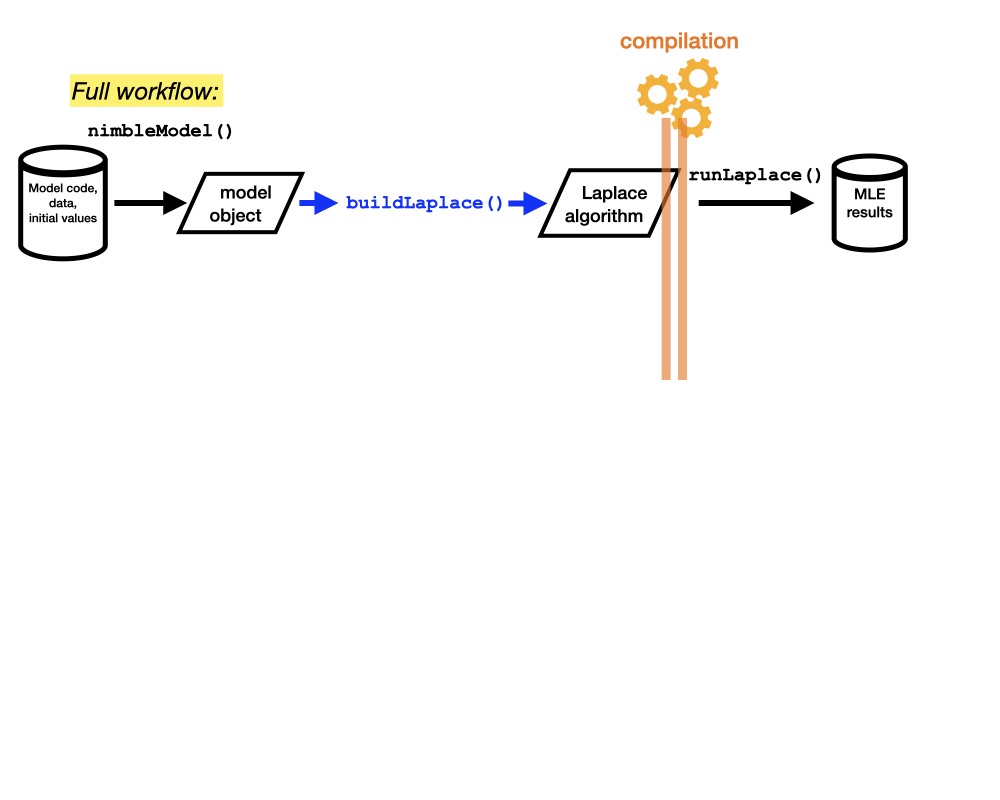

<style>
slides > slide {
  overflow-x: auto !important;
  overflow-y: auto !important;
}
</style>


```{r setup, include=FALSE}
knitr::opts_chunk$set(echo = TRUE, cache = TRUE)
library(nimble)
library(coda)
```

# 
<div style="margin-top:300px;">
</div>
<center>
**We have talked a lot about MCMC so far. So, something different in this last section!**
</center>

\

# Laplace approximation
- Laplace approximation (LA) is a fast method (often accurate) for approximating definite integrals
- In statistics, LA is often used to approximate marginal likelihoods / posterior distributions
- The problem LA aims to solve in statistics is
$$
\tag{1}
p(\mathbf{y}|\boldsymbol{\theta}) = \int p(\mathbf{y}, \boldsymbol{\mu} | \boldsymbol{\theta}) d\boldsymbol{\mu}=\int p(\boldsymbol{\mu} | \boldsymbol{\theta}) \times p(\mathbf{y} | \boldsymbol{\mu},\boldsymbol{\theta}) d\boldsymbol{\mu} \\ 
\approx p^{LA}(\mathbf{y}|\boldsymbol{\theta})=
\frac{(2\pi)^{n/2}}{\sqrt{det[H(\boldsymbol{\theta})]}} p(\mathbf{y},\hat{\boldsymbol{\mu}} | \boldsymbol{\theta}),
$$
where 
  - $\boldsymbol{\theta}$: a vector of model parameters (or top-level nodes in a model)
  - $\boldsymbol{\mu}$: a vector of random effects (or mid-level nodes )
  - $\mathbf{y}$: a vector of data (or bottom-level nodes)
  - $\hat{\boldsymbol{\mu}} = \hat{\boldsymbol{\mu}}(\boldsymbol{\theta})=argmax_{\mu}p(\mathbf{y},\boldsymbol{\mu} | \boldsymbol{\theta})$
  - $H(\boldsymbol{\theta}) = -\log p_{\boldsymbol{\mu}\boldsymbol{\mu}}''(\mathbf{y},\hat{\boldsymbol{\mu}} | \boldsymbol{\theta})$

\ 

# Laplace approximation
In general, formula (1) can be written as 
$$
p(\mathbf{y}|\boldsymbol{\theta}) = \int p(\mathbf{y}, \boldsymbol{\mu} | \boldsymbol{\theta}) d\boldsymbol{\mu} = \int p(\mathbf{y}_1, \boldsymbol{\mu}_1 | \boldsymbol{\theta}) d\boldsymbol{\mu}_1 \times \cdots \times \int p(\mathbf{y}_K, \boldsymbol{\mu}_K | \boldsymbol{\theta}) d\boldsymbol{\mu}_K \times p(\mathbf{y}^* | \boldsymbol{\theta}),
$$
where

- $(\mathbf{y}_k, \boldsymbol{\mu}_k), k=1, \ldots, K$ are $K$ *conditionally independent sets*
- $p(\mathbf{y}^* | \boldsymbol{\theta})$ specifies the likelihood component that does not depend on any random effects
- $(\mathbf{y}_1, \ldots, \mathbf{y}_K, \mathbf{y}^*) = \mathbf{y}, (\boldsymbol{\mu}_1, \ldots, \boldsymbol{\mu}_K) = \boldsymbol{\mu}$
- If there are **no random effects**, then nimble Laplace becomes **exact MLE**

\

# What is needed for Laplace and Laplace MLE?
- "Inner" optimisation to find $\hat{\boldsymbol{\mu}}(\boldsymbol{\theta})$
- Logdet of the Hessian $H(\boldsymbol{\theta})$
- Inner optimisation also benefits from the input of the gradient and Hessian
- "Outer" optimisation of maximizing $p^{LA}(\mathbf{y}|\boldsymbol{\theta})$ to find MLEs $\hat{\boldsymbol{\theta}}$
- The gradient of $p^{LA}(\mathbf{y}|\boldsymbol{\theta})$ wrt $\boldsymbol{\theta}$ can be obtained by combining different pieces of derivatives (up to 3rd order) of $p(\mathbf{y}, \boldsymbol{\mu} | \boldsymbol{\theta})$; See <a href="https://www.sciencedirect.com/science/article/abs/pii/S0167947306000764" target="_blank" style="color: blue">Skaug and Fournier (2006) </a> or <a href="https://www.jstatsoft.org/article/view/v070i05" target="_blank" style="color: blue">Kristensen et al. (2016) </a> 
- Numeric methods are used for inner and outer optimisations
- AD is used for obtaining derivatives for Laplace, so turn on AD for your model and distributions involved

\

# Laplace workflow
<center>
 
</center>

\

# Laplace in NIMBLE

- In NIMBLE, an LA algorithm can be built using **`buildLaplace`** as follows:
```{r,eval = FALSE }
laplace <- buildLaplace(model, # model object, the only compulsory input
                        paramNodes, # top-level stochastic nodes
                        randomEffectsNodes, # latent variables
                        calcNodes, # random effects and dependencies + necessary deterministic nodes
                        calcNodesOther, # data nodes depending only on params, i.e. y*
                        control = list() # Additional settings, e.g. inner optimiser, checking, Laplace split etc
                        )
````
- Compile the algorithm:
```{r, eval = FALSE}
Claplace <- compileNimble(laplace, project = model)
```
- Run it:
```{r, eval = FALSE}
res <- runLaplace(laplace, # Laplace algorithm
                  pStart,  # Start value for MLE
                  method = "BFGS",               # Outer optimisation method
                  originalScale = TRUE,          # Scale of MLE results: original or transformed (unconstrained)
                  randomEffectsStdError = TRUE,  # Return std. error of random effects?
                  jointCovariance = FALSE        # Return joint covariance matrix of params and random effects?
                  )
```

\

# Some notes about NIMBLE Laplace

- Input nodes (except for model code) for Laplace, if not provided or only partially provided, will be decided by **`setupMargNodes`**; see `help("setupMargNodes")`.

- The automatic decision process should be perfect in most cases, but not always. For example, for state-space models the initial state will be treated as a parameter, not random effect. One need provide the arguments manually.

- There is no need to worry about intermediate deterministic nodes; these will be added when necessary.

- One useful feature is the split of Laplace approximation (set `control = list(split = TRUE)` for `buildLaplace` or `split = TRUE` for `setupMargNodes`).

- For easier (better?) optimisation (both inner and outer), we apply automatic transformations to constrained parameter and/or random effects nodes; see `help("parameterTransform")`. 

- A very recent feature is that `nimOptim` can incorporate additional optimisation methods (e.g. those in `nlminb`). For Laplace, set the inner optimiser using `control = list(innerOptimMethod = "nlminb")` in `buildLaplace`. 

# Example I: the pump example

- The pump example <a href="https://www.jstor.org/stable/4616270" target="_blank" style="color: blue">(George et al. 1993) </a> is very simple, but has the potential to illustrate many features of nimble Laplace. 

- The model is: 
$$
\begin{aligned}
\alpha &\sim Exp(1.0) \\
\beta &\sim Gamma(0.1, 1.0) \\
\theta_i &\sim Gamma(\alpha, \beta) \\
y_i &\sim Pois(t_i\theta_i), i=1, \ldots, 10
\end{aligned}
$$
where $t_i$'s are constants.

- Build and compile model:
```{r, eval=FALSE}
code <- nimbleCode({ 
  for (i in 1:N){
    theta[i] ~ dgamma(alpha, beta)
    lambda[i] <- theta[i] * t[i]
    x[i] ~ dpois(lambda[i])
  }
  alpha ~ dexp(1.0)
  beta ~ dgamma(0.1, 1.0)
})
## Prepare constants, data, and initial values
consts <- list(N = 10, t = c(94.3, 15.7, 62.9, 126, 5.24, 31.4, 1.05, 1.05, 2.1, 10.5))
dat <- list(x = c(5, 1, 5, 14, 3, 19, 1, 1, 4, 22))
inits <- list(alpha = 0.1, beta = 0.1, theta = rep(0.1, consts$N))
## Build and compile model
pump <- nimbleModel(code, consts, dat, inits, buildDerivs = TRUE)
Cpump <- compileNimble(pump)
```
\

# Example I: the pump example (MLE)
- Build and compile the Laplace algorithm:
```{r, eval = FALSE}
laplace <- buildLaplace(pump)
cLaplace <- compileNimble(laplace, project = pump)
```
- Run Laplace: 
```{r,eval=FALSE}
mleres <- runLaplace(cLaplace)
```
- See the results:
```{r, eval=FALSE}
> mleres$summary$params
       estimate        se
alpha 0.8341549 0.3595452
beta  1.2806380 0.8017301

> mleres$summary$randomEffects
            estimate         se
theta[1]  0.06103909 0.02549690
theta[2]  0.10801449 0.08167549
theta[3]  0.09090210 0.03793850
theta[4]  0.11654683 0.03034844
theta[5]  0.58800369 0.30392498
theta[6]  0.60691146 0.13661688
theta[7]  0.78697548 0.60920678
theta[8]  0.78697548 0.60920678
theta[9]  1.42995345 0.70310364
theta[10] 1.93827829 0.42039230

## Joint vcov matrix (not shown here)
> mleres$summary$vcov

## Original scale? (not shown here)
> mleres$summary$originalScale
```
\

# Example I: the pump example (Laplace within MCMC)

**Option 1: integrate out all latent states (`'theta[1:10]'`) and use MCMC for parameters only (`'alpha'`, `'beta'`)**

- Laplace marginal log-likelihood is needed for sampling the parent nodes (`'alpha'` and `'beta'` here) of those integrated out
- Write a custom log-likelihood function
```{r, eval=FALSE}
llFun_Laplace <- nimbleFunction(
  setup = function(model, paramNodes, randomEffectsNodes, calcNodes) {
    laplace <- buildLaplace(model, paramNodes, randomEffectsNodes, calcNodes)
  },
  run = function() {
    pvals <- values(model, paramNodes)
    ll <- laplace$calcLaplace(pvals)
    returnType(double())
    return(ll)
  }
)
randomEffectsNodes <- "theta[1:10]"
paramNodes <- c("alpha", "beta")
calcNodes <- pump$getDependencies(randomEffectsNodes)
## Generate the custom log-likelihood function for MCMC
Rll_Laplace <- llFun_Laplace(pump, paramNodes, randomEffectsNodes, calcNodes)
```
- Specify a `RW_llFunction` sampler for parameter nodes `'alpha'` and `'beta'`
```{r, eval=FALSE}
mcmcConf1 <- configureMCMC(pump, nodes = NULL)
for(tarNode in c("alpha", "beta")){
  mcmcConf1$addSampler(target = tarNode, type = "RW_llFunction",
                      control = list(llFunction = Rll_Laplace, includesTarget = FALSE))
}
```
- Build, compile and run MCMC as illustrated before
\

# Example I: the pump example (Laplace within MCMC)
**Option 2: integrate out some latent states (say, `'theta[1:8]'`) and use MCMC for parameters and remaining latent states (`'theta[9:10]'`)**

- Write a custom log-likelihood function
```{r, eval=FALSE}
paramNodes <- c("alpha", "beta")
randomEffectsNodes <- "theta[1:8]"; calcNodes <- pump$getDependencies("theta[1:8]")
otherNodes <- "theta[9:10]"
llFun_Laplace <- nimbleFunction(
  setup = function(model, paramNodes, randomEffectsNodes, calcNodes, otherNodes) {
    laplace <- buildLaplace(model, paramNodes, randomEffectsNodes, calcNodes, control = list(check=FALSE))
  },
  run = function() {
    ll <- model$calculate(otherNodes) ## Log-likelihood component from theta[9] & theta[10]
    pvals <- values(model, paramNodes)
    ll <- ll + laplace$calcLaplace(pvals)
    returnType(double())
    return(ll)
  }
)
Rll_Laplace <- llFun_Laplace(pump, paramNodes, randomEffectsNodes, calcNodes, otherNodes)
```
- Set up MCMC
```{r, eval=FALSE}
mcmcConf2 <- configureMCMC(pump, nodes = "theta[9:10]")
for(tarNode in c("alpha", "beta")){
  mcmcConf2$addSampler(target = tarNode, type = "RW_llFunction",
                       control = list(llFunction = Rll_Laplace, includesTarget = FALSE))
}
mcmcConf2$addMonitors("theta[9]", "theta[10]") 
```

\

# Some notes about Laplace within MCMC

- The code to set this up seems a bit but most of the code could be copy-pasted.
- You will need to have a good understanding of your model structure to specify the approximate custom likelihood. 
- The `RW_llFunction` sampler in NIMBLE is a random-walk sampler using custom likelihood (Laplace here) instead of using `model$calculate()`; the multivariate version is `RW_llFunction_block`.
- Other samplers using Laplace/other custom likelihood functions could be set up similarly but will need you to modify the original samplers' code.
- Evaluating a single Laplace approximation is not expensive, but it is a different story when being involved in MCMC running a large number of iterations. Thus the MCMC+Laplace workflow would be ideal for models with high-dimensional and complex random effects structures.

\

# Example II: CJS model with missing covariates
This is a capture-recapture dataset of meadow voles initially described in <a href="https://esajournals.onlinelibrary.wiley.com/doi/abs/10.2307/1938741" target="_blank" style="color: blue">Nichols et al. (1992)</a>. It was analysed by <a href="https://academic.oup.com/biometrics/article/62/1/142/7306090?login=false" target="_blank" style="color: blue">Bonner et al. (2006)</a> (Bayesian MCMC) and <a href="https://link.springer.com/article/10.1007/s13253-022-00486-2" target="_blank" style="color: blue">Herliansyah et al. (2022)</a> (Laplace MLE).
```{r}
library(nimbleEcology) ## version 0.5.0 with AD support
load("cjsDataResults")
head(y, 10) ## Capture histories
head(x, 10) ## Covariate values
```
\

# Example II: CJS model with missing covariates
```{r,eval=FALSE}
## Model code
code <- nimbleCode({
  ## Priors 
  for(i in 1:2){
    beta[i] ~ dnorm(0, sd = 10)
    gamma[i] ~ dnorm(0, sd = 10)
  }
  logSigma ~ dnorm(0, sd = 10)
  sigma <- exp(logSigma)
  for(i in 1:(nocca-1)){
    mu[i] ~ dnorm(0, sd = 10)
  }
  ## Likelihood
  for(i in 1:N){## for each of N individuals
    for(t in fi[i]:(nocca-1)){
      ## Latent process (diffusion) for individual covariate values
      x[i, t+1] ~ dnorm(x[i, t] + mu[t], sd = sigma)
      ## Survival and capture probs in terms of covariates
      logit(captProb[i, t]) <- gamma[1] + gamma[2] * x[i, t]
      logit(survProb[i, t]) <- beta[1] + beta[2] * x[i, t]
    }
    ## Capture prob for the last occasion
    logit(captProb[i, nocca]) <- gamma[1] + gamma[2] * x[i, nocca]
    ## Likelihood for the observed data of the i-th individual
    y[i, fi[i]:nocca] ~ dCJS_vv(probSurvive = survProb[i, fi[i]:(nocca-1)], 
                                probCapture = captProb[i, fi[i]:nocca], 
                                len = len[i])
  }
})

## Prepare data for building the model
N <- nrow(y)
nocca <- ncol(y)
len <- nocca - fi + 1 ## fi contains the times of first detection for each individual
consts <- list(fi = fi, nocca = nocca, N = N, len = len)
data <- list(y = y, x = x)
inits <- list(beta = c(1,1), gamma = c(1,1), logSigma = 1, mu = rep(1,3))

## Build and compile the model
model <- nimbleModel(code, consts, data, inits, buildDerivs = TRUE)
cmodel <- compileNimble(model)

## Build and compile Laplace
laplace <- buildLaplace(model, paramNodes = c("beta", "logSigma", "gamma", "mu"))
claplace <- compileNimble(laplace, project = model)
```
\

# Example II: CJS model with missing covariates
### Results
```{r}
## Laplace MLE results 
round(mleres, 2)
## MCMC results taken from Bonner et al. (2006)
mcmcres
```
